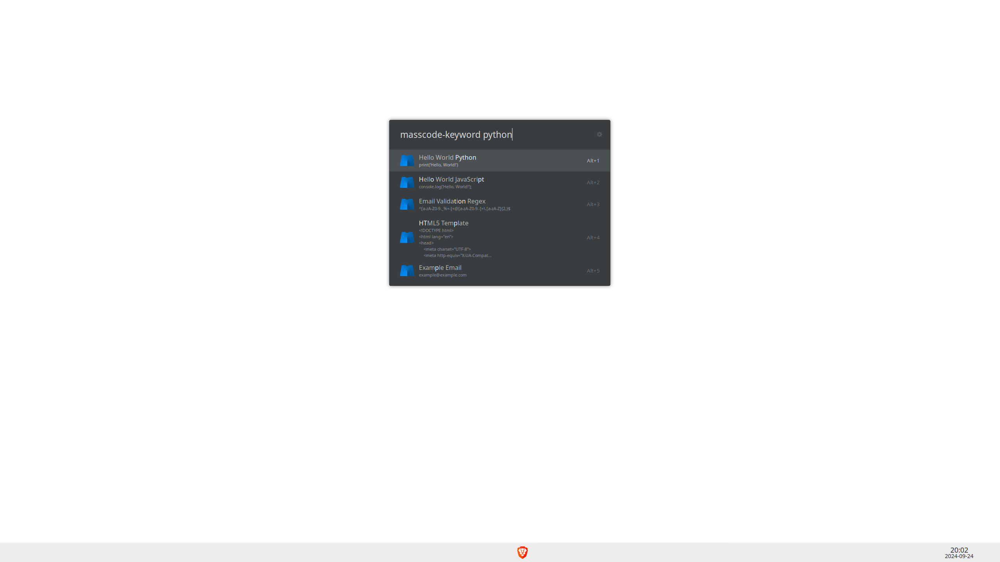
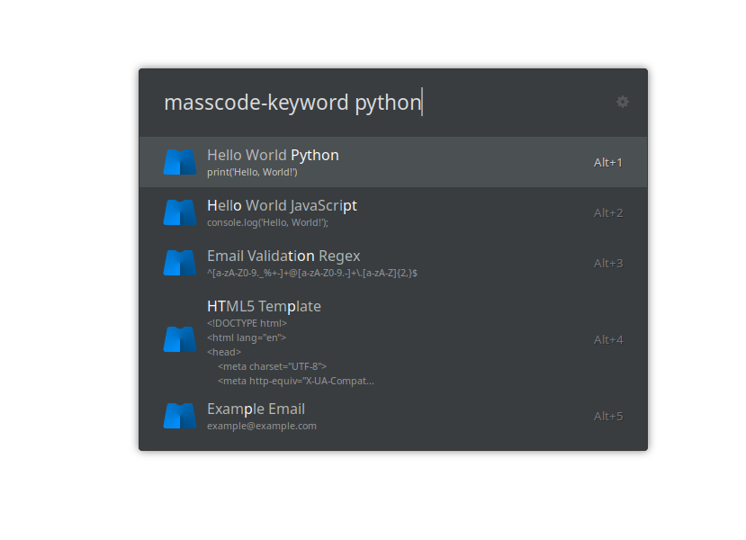
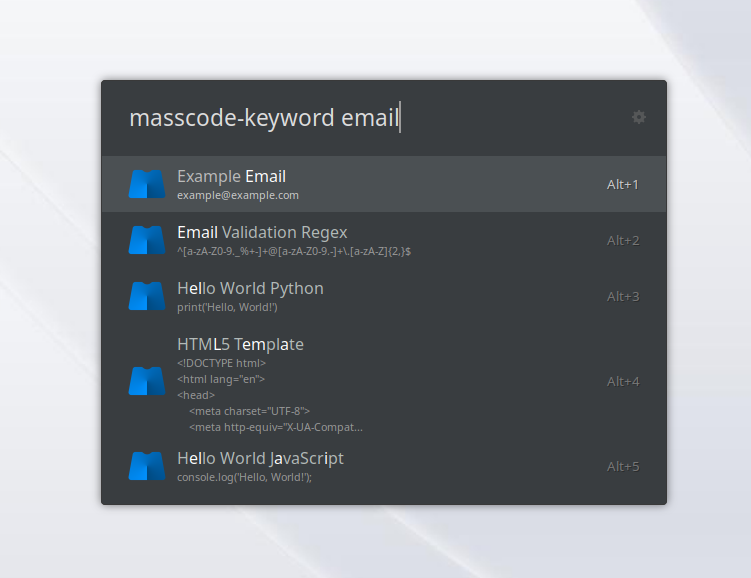

# 📄 Ulauncher Extension MassCode Integration

This plugin/extension allows you to easily access your **[MassCode](https://masscode.io) snippets** directly from **[Ulauncher](https://ulauncher.io)**. No need to manually open MassCode or browse through folders to find your snippets anymore. Just type the snippet name or part of it in Ulauncher, and boom – access it instantly! 🚀

## 🚀 Features Available

- 🔍 **Quick snippet search**: Type a keyword in Ulauncher to search through your MassCode snippets.
- 📂 **Choose database path**: You can specify the path to the JSON file containing your MassCode snippets.
- 📄 **Snippet preview**: View the content of your snippets directly in Ulauncher.
- 🧩 **Multi-fragment support**: Select individual fragments from multi-fragment snippets instead of pasting everything together.
- 🌟 **Personalized contextual autocomplete**: The extension intelligently prioritizes snippets based on your usage patterns.
- ✨ **Smart Single Result**: Optionally, if a snippet overwhelmingly dominates your selections for a specific query, the extension can show only that snippet.
- ⏩ **Quick access**: Choose between copying the snippet to your clipboard or pasting it directly (okay, the pasting option isn't functional yet, but one day... maybe?).
- 📥 **Save new snippets**: Save clipboard content directly to MassCode Inbox from Ulauncher — no need to open MassCode!

## 🆕 What's New (Recent Update)

We've rolled out updates to enhance your productivity:

### 🧩 Multi-Fragment Support (Per-Fragment Selection)

- **Individual Fragment Selection**: Multi-fragment snippets are now expanded into separate selectable entries in Ulauncher. Instead of pasting all fragments concatenated together, you can now choose exactly which fragment you need.
- **How it works**: When you search for a snippet with multiple fragments (e.g., "db-connection" with fragments "Config", "Connect", "Close"), each fragment appears as a separate result:
  - `db-connection [Config]` → `host = "localhost"`
  - `db-connection [Connect]` → `conn = create_connection(host)`
  - `db-connection [Close]` → `conn.close()`
- **Contextual Learning per Fragment**: The extension tracks which fragments you use most frequently and prioritizes them in future searches. If you always use "Fragment 2" for a specific query, it will appear at the top with a star (★) indicator.
- **Implementation**: This addresses issue #2 - special thanks to @Jopp-gh for the suggestion!

### 🌟 Personalized Contextual Autocomplete

- The extension learns from your search patterns and selections to prioritize the snippets you frequently use in specific contexts.
- When you search with a term similar to previous searches, snippets you've selected before will be marked with a star (★) and appear higher in results.
- The system is smart enough to only boost results when your current search is contextually relevant to your history.

### ✨ Smart Single Result (Optional)

- **Purpose**: To streamline results when you consistently pick the same snippet for a particular search query.
- **How it works**: If, for a specific search term, one snippet has been chosen a significantly high percentage of the time (e.g., you've picked "my_ssh_key" 9 out of 10 times when searching "ssh"), the extension can be configured to display *only* that dominant snippet.
- **Configuration**:
    - Go to Ulauncher Preferences -> Extensions -> MassCode Snippets.
    - Find the "Smart Single Result Ratio (0.0-1.0)" setting.
    - Set a value between 0.0 and 1.0. For example:
        - `0.0` (Default): Disables the feature.
        - `0.75`: If a snippet accounts for 75% or more of selections for a query, it will be the sole result.
        - `0.9`: Requires 90% dominance.
        - `1.0`: Requires 100% dominance (the snippet was the *only* one ever picked for that query).
    - This feature requires "Enable Contextual Learning" to be active.
- **Benefit**: Reduces clutter and speeds up access to your most-used snippets in familiar contexts.

### 📥 Save New Snippets to MassCode Inbox

- **Purpose**: Quickly save code snippets from your clipboard directly to MassCode's Inbox without opening MassCode.
- **How it works**: Use the `new` sub-command with your MassCode keyword to save whatever is currently in your clipboard as a new snippet.
- **Usage**:
    1. Copy some code or text to your clipboard (from any source).
    2. Open Ulauncher and type your MassCode keyword followed by `new`:
       - `ms new` — Saves with an auto-generated name (taken from the first line of your clipboard content).
       - `ms new my snippet name` — Saves with the custom name "my snippet name".
    3. Press Enter — the snippet is saved to MassCode's **Inbox** folder.
    4. A confirmation message appears: "Saved 'my snippet name' to MassCode Inbox".
- **Auto-naming**: If you don't provide a name, the extension uses the first non-empty line of your clipboard content (up to 50 characters). Comment prefixes like `#`, `//`, `<!--` are stripped automatically.
- **Organization**: Snippets are saved to MassCode's **Inbox** (unassigned). Open MassCode later to organize, tag, and move them to folders.
- **Compatibility**: Works with all MassCode versions (V3 JSON, V4 SQLite, V5 Markdown Vault).
- **Note**: For V3 (JSON) and V5 (Markdown), the extension uses atomic file writes to minimize the risk of data corruption if MassCode is running simultaneously.

### 🗄️ MassCode V4+ Support

- **Full SQLite Support**: The extension now supports both MassCode V3 (JSON) and V4+ (SQLite) database formats.
- **Automatic Version Detection**: Choose your MassCode version in the extension preferences to ensure proper database format handling.
- **Seamless Migration**: When you upgrade to MassCode V4+, the application automatically migrates your JSON data to SQLite format - no manual intervention required from the extension.
- **Configuration**:
    - Go to Ulauncher Preferences -> Extensions -> MassCode Snippets.
    - Select "MassCode Version" and choose between:
        - "V3 or earlier (JSON file)" - for older MassCode installations using db.json
        - "V4+ (SQLite database)" - for newer MassCode installations using massCode.db
- **Benefits**: Stay current with the latest MassCode features while maintaining compatibility with older installations.

### 📊 How Contextual Features Work

1. The extension tracks which snippets you select with specific search queries (if contextual learning is enabled).
2. When you search again using the same or similar terms, the system recognizes the context.
3. Snippets you've selected before in similar contexts get a relevance boost (contextual autocomplete).
4. If the "Smart Single Result" feature is enabled and its ratio threshold is met for the current query, only the dominant snippet is shown.
5. The algorithm uses both exact matching and fuzzy matching with gradual relevance scoring.
6. Your most frequently used snippets for specific search patterns rise to the top.

### 🎯 Precision Focus

Unlike overly aggressive autocomplete systems that suggest the same items regardless of context, our implementation:
- Only prioritizes items when truly relevant to your current search.
- Maintains a balance between historical preferences and textual relevance.
- Provides visual indicators (★) so you know when items are being contextually boosted.

## 🛠️ Installation

To install and try out the **Ulauncher Extension MassCode Integration**, follow these steps:

1. Clone this repository or download it as a ZIP file.
2. In your terminal, navigate to your Ulauncher extensions folder. The path is typically `~/.local/share/ulauncher/extensions/`. If a `masscode-snippet` subfolder doesn't exist, create it.
   ```bash
   mkdir -p ~/.local/share/ulauncher/extensions/masscode-snippet/
   cd ~/.local/share/ulauncher/extensions/masscode-snippet/
   ```
3. Clone this repository into the `masscode-snippet` folder or move the downloaded files there:
   ```bash
   # If you are inside masscode-snippet folder already:
   git clone https://github.com/mathe00/ulauncher-extension-masscode-integration.git .
   # Or, if you downloaded and extracted, copy files here.
   ```
4. Before restarting Ulauncher, install the required dependencies by running:
   ```bash
   # Ensure you are in the masscode-snippet extension directory
   # Create a libs folder if it doesn't exist
   mkdir -p libs
   pip install -r requirements.txt -t libs/
   ```
5. Restart **[Ulauncher](https://ulauncher.io)**.

6. **Important:** After installation, it is highly recommended to configure the settings for the extension. Open Ulauncher, navigate to the extensions section, and adjust the preferences for the MassCode plugin/extension. This includes:
   - Setting the path to your MassCode database (db.json for V3, massCode.db for V4+)
   - Selecting your MassCode version (V3/earlier uses JSON, V4+ uses SQLite)
   - Enabling contextual learning
   - Configuring the "Smart Single Result Ratio"

That's it! The plugin/extension is now installed, and you can start searching your MassCode snippets directly from **[Ulauncher](https://github.com/Ulauncher/Ulauncher)**.

## 🖼️ Screenshots

Here are some examples of how the Ulauncher Extension MassCode Integration works:







*Feel free to include your own screenshots to showcase how the plugin/extension works in action!*

## 🛠️ Contributing

Open to feedback, issues, and pull requests. 😊
