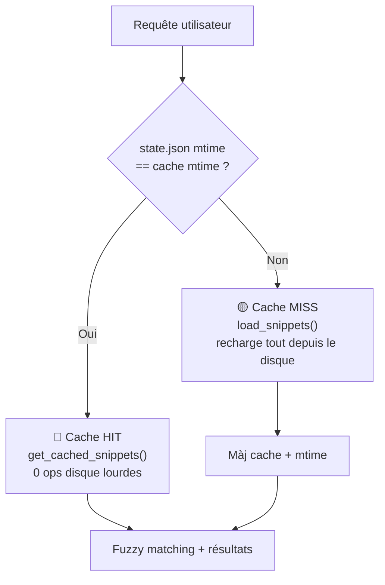

# Plan : Cache mémoire pour snippets (suppression des lenteurs)

## Problème

À chaque frappe clavier dans Ulauncher, `load_snippets()` est appelé et **recharge TOUS les snippets depuis le disque**. Pour V5+ (Markdown Vault), ça signifie :
- Lecture de `state.json`
- Scan de **tous les dossiers** pour les `.meta.yaml`
- Ouverture + parsing YAML + parsing regex du corps de **chaque fichier .md**

Pour 50-200 snippets, c'est l'équivalent de 50-200 ops disques synchrones **à chaque caractère tapé**. C'est la cause directe de la friction UX.

## Solution retenue

**Cache mémoire avec validation par `mtime`** (approche A validée) :

Les snippets sont gardés en mémoire dans une variable module-level. À chaque appel, on `stat()` uniquement le fichier source (`state.json`) pour vérifier s'il a changé. Si non → retour instantané du cache (0 ops disque lourdes). Si oui → rechargement et mise à jour.

### Fichiers impactés

| Fichier | Action |
|---------|--------|
| `src/database/cache.py` | **NOUVEAU** — classe `SnippetCache` |
| `src/events/listeners.py` | **MODIFIÉ** — utilise `SnippetCache.get_snippets()` au lieu de `load_snippets()` direct |

`loader.py` n'est pas modifié — `cache.py` l'importe et l'appelle uniquement en cas de cache miss.

## Détail des changements

### 1. `src/database/cache.py` (nouveau fichier)

```python
"""
Snippet Cache Module
Cache mémoire avec invalidation par mtime. Les snippets sont rechargés
uniquement quand le fichier source (state.json pour V5) change.
"""

import os
import logging
from typing import List, Dict, Any, Optional

from .loader import load_snippets, resolve_vault_space_dir
from ..constants import VAULT_META_DIR, VAULT_STATE_FILE, MASSCODE_V5

logger = logging.getLogger(__name__)


class SnippetCache:
    """Singleton de cache des snippets avec invalidation par mtime."""

    _snippets: Optional[List[Dict[str, Any]]] = None
    _source_mtime: float = 0.0
    _db_path: str = ""
    _masscode_version: str = ""

    @classmethod
    def get_snippets(cls, db_path: str, masscode_version: str) -> List[Dict[str, Any]]:
        """Retourne les snippets depuis le cache ou les recharge si modifiés."""
        current_mtime = cls._resolve_mtime(db_path, masscode_version)

        if (
            cls._snippets is not None
            and cls._db_path == db_path
            and cls._masscode_version == masscode_version
            and cls._source_mtime == current_mtime
        ):
            logger.debug("Snippet cache HIT")
            return cls._snippets

        logger.debug("Snippet cache MISS — reloading from disk")
        cls._snippets = load_snippets(db_path=db_path, masscode_version=masscode_version)
        cls._source_mtime = current_mtime
        cls._db_path = db_path
        cls._masscode_version = masscode_version
        logger.info(
            "Cache mis à jour : %d snippets (mtime=%.3f)",
            len(cls._snippets),
            current_mtime,
        )
        return cls._snippets

    @classmethod
    def _resolve_mtime(cls, db_path: str, masscode_version: str) -> float:
        """
        Récupère le timestamp de modification de la source faisant autorité.

        - V5  : state.json (dans .masscode/ du space dir)
        - V4  : massCode.db
        - V3  : db.json
        """
        expanded = os.path.expanduser(db_path)

        if masscode_version == MASSCODE_V5:
            space_dir = resolve_vault_space_dir(expanded)
            state_file = os.path.join(space_dir, VAULT_META_DIR, VAULT_STATE_FILE)
            return cls._safe_mtime(state_file)
        else:
            return cls._safe_mtime(expanded)

    @staticmethod
    def _safe_mtime(path: str) -> float:
        try:
            return os.path.getmtime(path) if os.path.exists(path) else 0.0
        except OSError:
            return 0.0

    @classmethod
    def invalidate(cls) -> None:
        """Force l'invalidation du cache (utile pour un refresh manuel)."""
        cls._snippets = None
        cls._source_mtime = 0.0
        cls._db_path = ""
        cls._masscode_version = ""
```

### 2. `src/events/listeners.py` (modifications)

Deux changements localisés :

Dans les imports (ligne 21-26) :
```python
# Remplacer :
from ..database.loader import load_snippets, ...

# Par :
from ..database.loader import is_json_file, is_sqlite_file, is_markdown_vault
from ..database.cache import SnippetCache
```

Dans la méthode `on_event` (ligne 108-109) :
```python
# Remplacer :
snippets = load_snippets(db_path=db_path, masscode_version=masscode_version)

# Par :
snippets = SnippetCache.get_snippets(db_path=db_path, masscode_version=masscode_version)
```

## Algorithme de cache



## Cas particuliers gérés

| Scénario | Comportement |
|----------|-------------|
| MassCode ajoute un snippet | `state.json` modifié → mtime change → cache invalidé → rechargé |
| MassCode modifie un snippet | `state.json` modifié → mtime change → cache invalidé → rechargé |
| MassCode supprime un snippet | `state.json` modifié → mtime change → cache invalidé → rechargé |
| Utilisateur change le `db_path` dans les préférences | Nouveau path → cache miss → rechargé |
| Utilisateur change `masscode_version` | Nouvelle version → cache miss → rechargé |
| `state.json` n'existe pas | `_safe_mtime()` retourne 0.0 → cache miss → tentative de chargement |

## Gains attendus

- **1ère requête** après lancement Ulauncher : identique (cache miss, load normal)
- **Requêtes suivantes** (mêmes snippets) : **instantané** — 0 ops disque lourdes, juste un `stat()` sur `state.json`
- **Pire cas** (cache invalidé entre deux frappes) : le temps de `stat()` + retour immédiat si mtime inchangé
- **Impact mémoire** : ~1-5 MB pour 200 snippets (négligeable)

## Non couvert (hors scope)

- Cache de `context_history.json` : fichier petit, pas un bottleneck
- Cache disque persistant : overkill, la mémoire suffit
- Invalidation watch filesystem (inotify) : overkill pour Ulauncher
- Option refresh manuel : pourrait être ajoutée plus tard via une sous-commande `ms refresh`

## Tests

1. **Test unitaire** pour `SnippetCache` :
   - Mock de `os.path.getmtime` pour contrôler le mtime
   - Vérifier que `load_snippets()` n'est appelé que quand mtime change
   - Vérifier l'invalidation manuelle

2. **Test d'intégration** :
   - Lancer l'extension, faire une requête
   - Vérifier dans les logs "Snippet cache MISS" puis "Snippet cache HIT" sur la 2e requête

## Ordre d'implémentation

1. Créer `src/database/cache.py`
2. Modifier les imports de `src/events/listeners.py`
3. Remplacer l'appel `load_snippets()` par `SnippetCache.get_snippets()`
4. Vérifier que les imports sont corrects (pas de circular dependency)
5. Lancer l'extension manuellement et observer les logs
